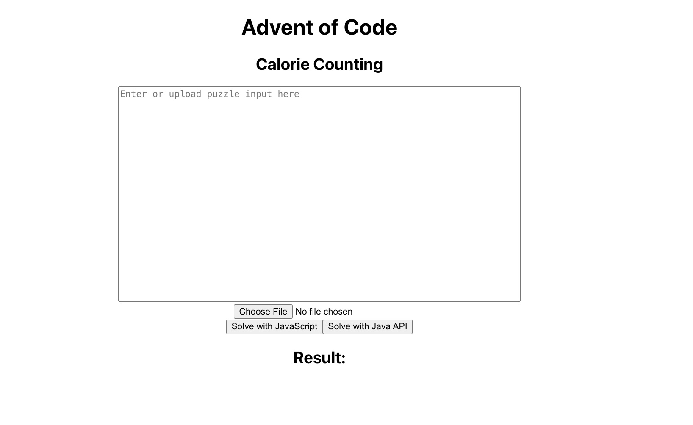
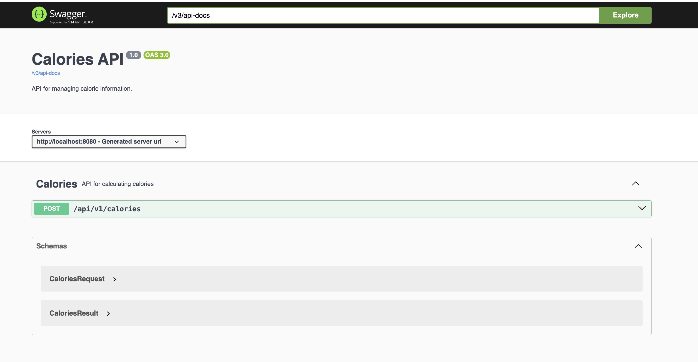

# Calorie Counting App




## Introduction


The **Calorie Counting App** is a web application built using **Java** for the backend and **React/TypeScript** for the frontend. It solves the [Advent of Code Day 1: Calorie Counting problem](https://adventofcode.com/2022/day/1) by processing a list of calorie values (either entered as text or uploaded via file). The app computes the maximum calories carried by a single elf and the sum of the top 3 calories carried by different elves. You can solve the problem using either **JavaScript** or **Java**, with both solutions provided within the app.

- **JavaScript Solution**: Implemented in the `getTopCalories` function within the [CaloriePuzzle component](./frontend/src/components/CaloriePuzzle.tsx).
- **Java Solution**: Implemented in the `getTopCalories` method in the [CaloriesCalculator class](./CaloriesApi/src/main/java/com/example/CaloriesApi/Services/CaloriesCalculator.java).

## Technologies Used

- **Java** (Spring Boot)
- **React** (TypeScript)
- **Docker**
- **Nginx**
- **Swagger**
- **Maven**

## Prerequisites

Make sure you have **Docker** installed and running on your machine before proceeding with the setup.

## Running the App

### 1. Clone the Repository
   ```bash
   git clone https://github.com/JoyProg/CalorieCountingApp.git
   cd CalorieCountingApp
   ```

### 2. Configure Environment Variables

- Create a `.env` file in the `frontend` directory, or copy the provided `.env.example` and rename it to `.env`. The `.env.example` file has the following line to set the API base URL:

   ```bash
   REACT_APP_CALORIES_API_BASE_URL=http://localhost:8080
   ```

### 3. Run the Application with Docker

- Use **Docker Compose** to build and run both the frontend and backend:

   ```bash
   docker-compose up --build
   ```

This will start:
- The **React frontend** on `http://localhost:3000`.
- The **Java backend** on `http://localhost:8080`.

## Using the App

### Frontend

1. Open your browser and go to `http://localhost:3000`.
2. You can either:
- **Enter a string of calorie values** (e.g., 1000\n2000\n3000\n) into the text box.
- **Upload a file** containing calorie numbers (a sample input file is provided as [puzzleInput.txt](./puzzleInput.txt)).
3. Choose one of the options:
   - **Solve with JavaScript**: To use the JavaScript implementation.
   - **Solve with Java**: To use the Java backend via the API.
4. The result will display the maximum calories and the sum of the top 3 highest calorie counts.

### Backend (Swagger API)

1. Navigate to the **Swagger UI** for the backend API: `http://localhost:8080/swagger-ui.html`.
2. Click on the `api/v1/calories` endpoint to test the calorie counting API.
3. Click the **Try it out** button.
4. Enter a string of calorie numbers and specify the number of top `k` calories you want to calculate (in the problem, `k = 3`).
5. Execute the request to see the results from the Java API.

## Project Structure

- **Frontend (React)**:
  - Source code is located in the `frontend/src/` directory.
  - The primary logic for solving the problem with JavaScript is in [CaloriePuzzle.tsx](./frontend/src/components/CaloriePuzzle.tsx).

- **Backend (Java)**:
  - The Spring Boot application is in the `CaloriesApi` directory.
  - The core logic for solving the problem with Java is in [CaloriesCalculator.java](./CaloriesApi/src/main/java/com/example/CaloriesApi/Services/CaloriesCalculator.java).
  - API routes are available under `/api/v1/calories`.
